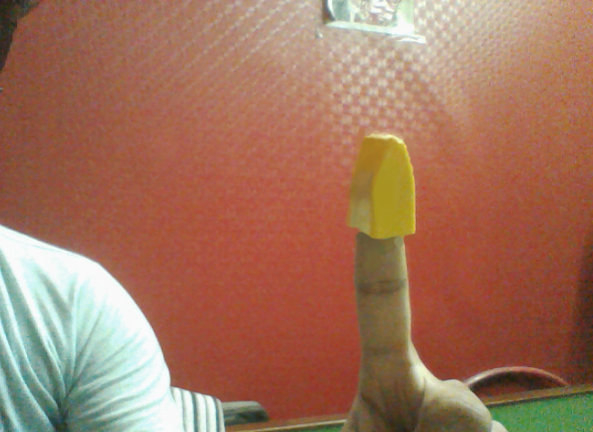
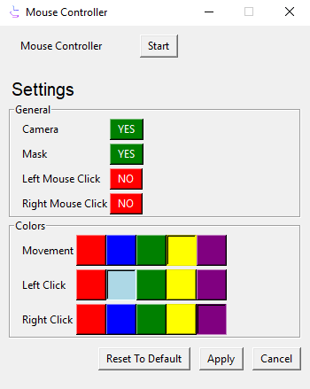
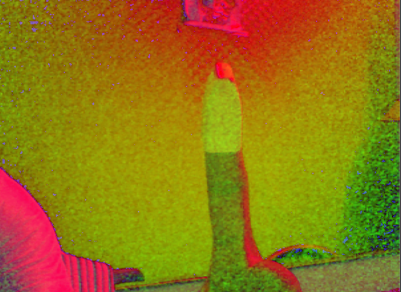
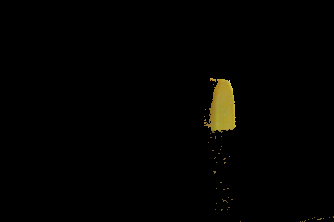

# Mouse Controller using Hand Gesture


Mouse Controller is a Python application which uses Computer Vision to increase Human Computer Interaction by using Hand Gestures to control the mouse pointer and clicks. 
To detect hand gestures, we use coloured caps to detect hand and it's movement as shown in figure below:



# Authors
This project is build by:
- [Nishkarsh Makhija](https://github.com/NishkarshMakhija)
- Sakshi Vyas
- [Shubhi Singh](https://github.com/ShubhiSingh939)

# Features

  - Controlling Mouse Pointer using Hand with colored caps.
  - Using different dedicated colour to click both Left and Right Mouse Buttons.
  - User may choose to use Left and Right mouse button individually.
  - User may set the colour of different available funcationality as per their requirements.
  - User may choose to see video captured by web camera.
  - User may also choose to see the mask video generated by object which will help him to determine particular colour is according to the environment needs.

# Using the Application

## Prerequisites
To run this application we need fulfill following prerequisite:
### 1. Hardware Reuirements
Application need a **web camera** attached to the system which help it record video to detect hand gestures.
### 2. Software Reuirements
This application required **Python 3.*** or later installed in your system.
Install the following libraries to start the application.
Use following commands to install all the libraries.
```sh
$ pip install PyQt5
$ pip install opencv-python
$ pip install imutils
$ pip install PyAutoGUI
```

Alternatively, you can use **requiremnts.txt** file to install all the requirements at once.
The following command will install the packages from requirements.txt file.
```sh
$ pip install -r requirements.txt
```

## Running the application

To run the application, double click on the **main.py** file and it will open the main screen as shown below:

You can set the configuration to run the application according to your needs. Do not forget to hit *Apply* Button!

Click **Start** to start the application.



# Screenshots





# Extra Documents

Class Diagram of the project is given as pdf above for better understanding

#### Use Case Diagram


#References
1. This project uses the concept of Ball Tracking with OpenCV by [PyImageSearch](https://www.pyimagesearch.com)
